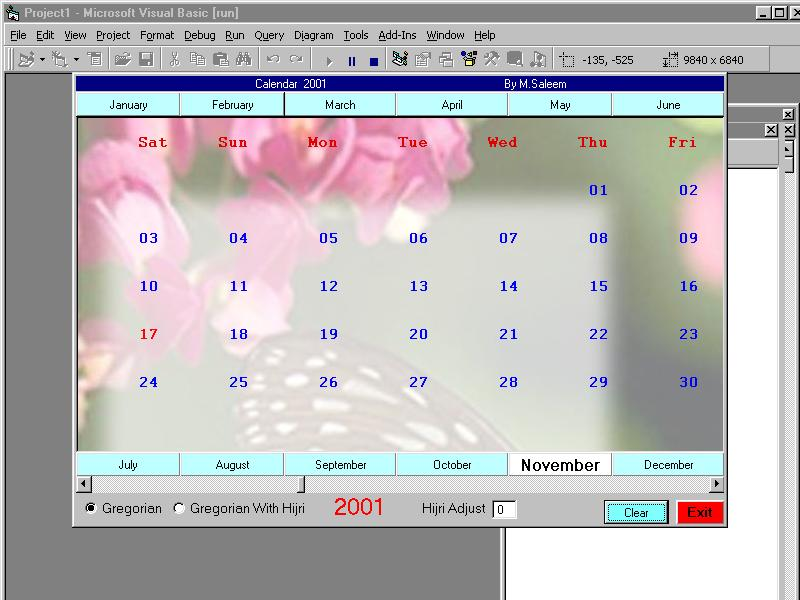



## NewCalendar

### Description

This is my modified Calendar.In This calendar I am not using any single date function to calculate the date.This will display Hijri as well as gregorious calendar.I have added more facilities in this calendar.If you don't mind please vote......
 
### More Info
 

             |
---                |---
**Submitted On**   |2001-10-17 12:25:50
**By**             |[N/A](https://github.com/Planet-Source-Code/PSCIndex/blob/master/ByAuthor/empty.md)
**Level**          |Intermediate
**User Rating**    |4.7 (28 globes from 6 users)
**Compatibility**  |VB 5\.0, VB 6\.0
**Category**       |[Complete Applications](https://github.com/Planet-Source-Code/PSCIndex/blob/master/ByCategory/complete-applications__1-27.md)
**World**          |[Visual Basic](https://github.com/Planet-Source-Code/PSCIndex/blob/master/ByWorld/visual-basic.md)
**Archive File**   |[NewCalenda2947810172001\.zip](https://github.com/Planet-Source-Code/newcalendar__1-28173/archive/master.zip)

